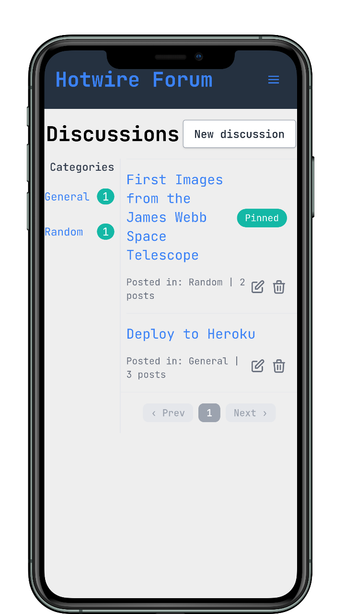

<h1 style="margin-top: 0px;">Hotwire Forum</h1>

This is an implementation of online discussion site where people can hold conversations in the form of posted messages. Project development is heavily dependent on <a href="https://hotwired.dev/">Hotwire</a> - default frontend framework for Rails 7. 

</img> 

### Overview:

The reason to use Hotwire in this project is to support an application where most of the dynamic nature happens by making normal HTTP requests to the server, receiving HTML for a part of the page, and inserting that HTML in the correct place in the DOM for a page update. The intention is that writing the complex logic in Ruby and Rails will be easier than writing it in the JavaScript ecosystem.

### Features:

- user authentication and authorization

- ability to add/update/delete Posts in Discussions

- categories to section off discussions

- real-time updates when new posts are created, discussions are updated or categories are moved

- notifications

### Demo:

You can try it out [here](https://secure-retreat-04532.herokuapp.com/).

### Contributing:

Pull requests are welcome.
